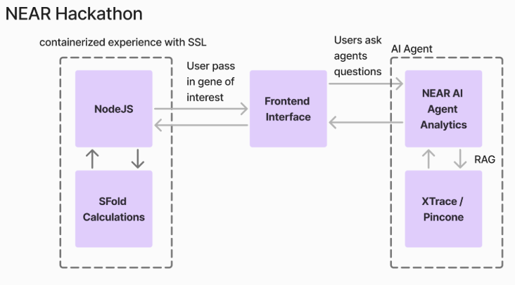
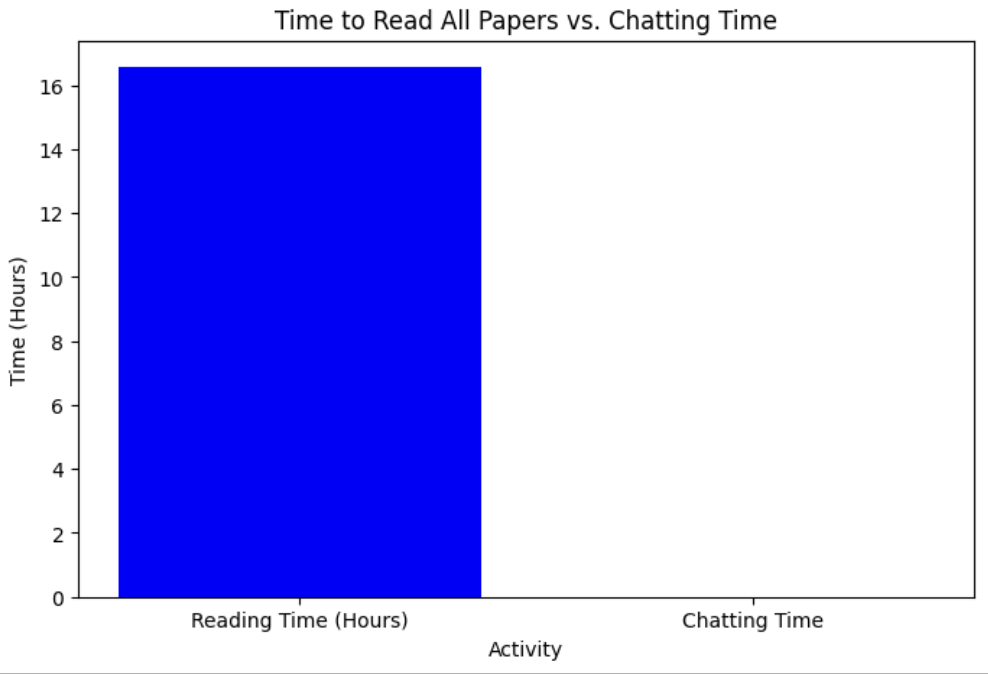

# RNA Structure Analysis and Design Agent (SAGENT)

This tool analyzes RNA structure prediction data from Sfold and evaluates design candidates for RNA targeting.

## Setup

1. Install the required dependencies:
   ```
   pip install -r requirements.txt
   ```

2. Set your OpenAI API key as an environment variable:
   ```
   export OPENAI_API_KEY='your-api-key'
   ```
   
   Alternatively, you can create a `.env` file in the project root with:
   ```
   OPENAI_API_KEY=your-api-key
   ```
   
   And then load it in your code with:
   ```python
   from dotenv import load_dotenv
   load_dotenv()
   ```

## Usage

Run the main script from the agent directory:

```
cd agent
python main.py
```

By default, the script will:
1. Look for Sfold output data in `../output`
2. If not found, it will use dummy data for demonstration
3. Evaluate design candidates using OpenAI's API
4. Rank the designs based on therapeutic potential
5. Generate a recommendation report in `recommendation_report.md`

## Components

- `file_parser.py`: Parses Sfold output files
- `design_evaluator.py`: Evaluates RNA design candidates using LLM
- `ranking_agent.py`: Ranks designs based on multiple criteria
- `report_generator.py`: Generates a final recommendation report
- `main.py`: Orchestrates the workflow

## Customization

You can modify the weights used for ranking in the `RankingAgent` initialization:

```python
ranking_agent = RankingAgent(
    weight_therapeutic=0.4,
    weight_research=0.2,
    weight_understanding=0.2,
    weight_versatility=0.2
)
```

# Sagent - Useful AI Agent for SFold

[Website](https://aso-frontend.vercel.app/)

## Quickstart
0. Have your Sagent Key in `./sagent/` as "sagent-key.pem"
1. Install [Anaconda](https://www.anaconda.com/download/success)
2. Based on [NEAR AI GitHub](https://github.com/nearai/nearai?tab=readme-ov-file#log-in),
create [NEAR AI account](https://wallet.near.org/) (speaker rec Meteor)

```
chmod 400 "sagent-key.pem"
ssh -i "sagent-key.pem" admin@ec2-18-216-25-202.us-east-2.compute.amazonaws.com

conda create -n useful_agent python=3.10 -y
conda activate useful_agent
pip install nearai
```

## Frontend
Go into frontend folder and run
```bash
npm i 
npm run dev
```

## Literature embeddings
The literature on Sfold and RNA sequences is in /literature. We use xtrace to create a knowlege base in vectorstore.ipynb

## Useful Links

- [Submission Form](https://docs.google.com/forms/d/e/1FAIpQLSebTq_Md0PwklTTNhr-zdidkk6Y45VeQ_kefyJrqJGnaVjsaA/viewform)
- [Bounty Notion Page](https://near-foundation.notion.site/Useful-Agent-Hackathon-Bounty-Board-1b3da22d7b6480049c88d19c52c16260)
- [ClinVar](https://www.ncbi.nlm.nih.gov/clinvar/)
- [Sfold site](https://sfold.wadsworth.org/cgi-bin/index.pl)

## SFold Docs

[Original Project](https://github.com/Ding-RNA-Lab/Sfold)

This repository contains the Sfold suite of tools.

To download the source code and executables, click on the green "Code" button.

To install and load sfold, read the RUNNING_SFOLD file in this directory.

The starmir scripts for binding site prediction and ranking are in the subfolder
"STarMir".

These programs only run under Linux.  It is probable they could be compiled
and run under other *nix operating systems.

## Architecture

The project is comprised of three main parts. The dockerized SFold projet, front end interface, and NEAR agents.

## Benchmark

In a traditional approach, it would take approximately 16.57 hours to read through multiple papers and manually extract the relevant information. This process involves skimming, identifying key points, and analyzing content, which is time-consuming and prone to human error.

In contrast, using the NEAR AI Agent, this entire process can be completed in seconds. The AI agent leverages advanced natural language processing techniques to quickly sift through large volumes of text, accurately extracting and summarizing the most pertinent information. This dramatic reduction in time not only boosts productivity but also ensures more reliable and consistent results, highlighting the efficiency and power of AI in research and data analysis.

Some other value adds include repository being dockerized.